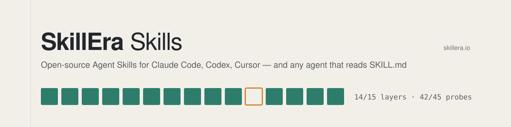

<picture>
  <source media="(prefers-color-scheme: dark)" srcset="assets/banner-dark.svg">
  
</picture>

[](https://github.com/KDavidP1987/dod-skill/actions/workflows/validate.yml)
[](.claude-plugin/plugin.json)
[](LICENSE)

# dod — Definition of Done

*Plan a feature across fifteen consideration layers, get the plan independently reviewed, freeze it,
track the build against it, and close with a number: how much of the design the plan foresaw.*

Version 0.1.4 · MIT · an [Agent Skill](https://agentskills.io) by [SkillEra](https://skillera.io) · [Walkthrough of a real plan](docs/dod-walkthrough.md)

## Contents

1. [What it is for](#what-it-is-for)
2. [Install](#install)
3. [Set up a project](#set-up-a-project)
4. [Commands](#commands)
5. [A plan, end to end](#a-plan-end-to-end)
6. [The artifacts](#the-artifacts)
7. [Reviewers](#reviewers)
8. [Audience profile](#audience-profile)
9. [The referee script](#the-referee-script)
10. [Rules the skill will not bend](#rules-the-skill-will-not-bend)
11. [Limits of this version](#limits-of-this-version)
12. [Files in this skill](#files-in-this-skill)

## What it is for

Most features are planned as their base functionality. The other 80 % — the empty state, the second
user, the abusive input, the dependency that is down, the rollback — is discovered during the build, in
cycles of revision. `dod` front-loads that discovery: it walks a fixed set of fifteen consideration
layers, refuses to call a plan ready until every applicable layer has an evidenced answer and an
independent reviewer agrees, then tracks the build against the plan and reports how much of the design
the plan foresaw.

It is **explicit-only**. It runs when you invoke `/dod`, name the skill, or ask for a "definition of
done" for a specific feature — or when your project's instructions file says feature planning goes
through it. An ordinary "make a plan for dark mode" does not trigger it, and it never interrupts to ask
whether it should.

Sizes: `S`, `M`, `L`, `Epic`. Smaller than `S` (a typo, a one-line fix) and the skill says so and stops.

## Install

```bash
npx skills add KDavidP1987/dod-skill                          # any agent that reads SKILL.md
```

```
/plugin marketplace add KDavidP1987/dod-skill                 # Claude Code
/plugin install dod@dod-skill
```

Or copy this folder to `~/.claude/skills/dod/`, `~/.codex/skills/dod/` or `~/.cursor/skills/dod/`. The
helper script needs **Node 20+**; without it `list` and `status` still work from the plan files, but
the invariants are not checked and the skill says so on every transition.

## Set up a project

```
/dod setup
```

`setup` creates the plan store (`docs/dod/` by default), shows you a pointer block before writing it into
`CLAUDE.md` / `AGENTS.md` / Cursor rules, and offers a session-start hook and a `pre-push` index check.
Nothing is written silently. The pointer block is what other sessions — and other agents — read:

```markdown
<!-- dod:begin v1 -->
## Definition of Done plans
dod-store: docs/dod
Plans live in the store above (index: `README.md` there). Before building anything that has a plan there,
read the plan and follow its `## Build plan`; check items only with evidence; record anything the plan
did not foresee as an amendment before building it; never edit `## Baseline`. Before claiming a feature
is finished, run the `dod` skill's `status` on it. Trigger policy: manual — plan with `dod` only when
the user asks for it.
<!-- dod:end -->
```

| Flag | Effect |
|---|---|
| `--auto-trigger` | Trigger policy `auto`: "plan / design / build a feature" runs `dod` without being named. |
| `--manual` (default) | Explicit-only. |
| `--hooks` | Session-start hook that prints one line: open plans and whether the index is fresh. |
| `--git-hook` | `pre-push` hook running `dod-index.mjs --check-index`; fails the push on a stale index. |
| `--check` | Reports store, pointer block, hooks and Node status without changing anything. |
| `--remove` | Removes the block and hooks; leaves the plans. |

## Commands

Natural language is the interface; `/dod <command>` forms are aliases.

| Command | Does |
|---|---|
| `plan [--autonomous] [--size S\|M\|L\|Epic] <request>` | Recon → layer pass → questions → draft → review → approve. Default when a request is given. |
| `approve <slug>` | Records an existing `READY` review and freezes the baseline → `ready`. Not itself a review. |
| `start <slug>` | `ready → in-progress`. States the three builder rules. |
| `status [slug]` | Verifies each item's evidence, writes evidence lines, lists what is unverified. Never changes lifecycle state. |
| `amend <slug> <discovered\|requested\|defect\|external> <change>` | Records unplanned work once, typed, and edits the DoD to match. |
| `close <slug>` | `done` only when every item has evidence; writes the report. |
| `report <slug>` | Prediction rate, missed probes, completion vs baseline and vs current. |
| `list` | Open plans with progress and warnings. |
| `setup [...]` | See above. |
| `explain <Dn\|An\|Fn\|question n>` | Restates one item, amendment, finding or question one level plainer, with an example. Changes no file. |
| `cancel <slug>` · `supersede <slug> --by <slug>` · `reopen <slug>` | Terminal and reverse transitions. |

`--autonomous` asks nothing except blocking gaps (gating probes; decisions about permissions, retention,
external contracts, irreversible choices) and fills everything else with a labelled `reversible`
assumption that carries its fallback.

## A plan, end to end

```
/dod plan CSV export for the invoices page
```

1. **Size.** `M — one module, one new endpoint, one data-format addition.`
2. **Recon.** The skill reads the modules the feature touches, the tests, the schema, auth and routing,
   and records the commit it read. It never asks what the code can answer. Greenfield: it states each
   assumption it would otherwise have looked up, typed `validated` / `reversible` / `decision-required`.
3. **Layer pass.** Fifteen layers, forty-five probes. Each probe is answered from the brief plus recon
   with a pointer into the plan, or it is a **Gap**.

   | # | Layer | # | Layer | # | Layer |
   |---|---|---|---|---|---|
   | 1 | Purpose & typical use | 6 | External dependencies & contracts | 11 | Design & UX |
   | 2 | Actors & permissions | 7 | States & lifecycle | 12 | Failure handling & observability |
   | 3 | Inputs, outputs & data | 8 | Minimal stretch | 13 | Performance & scale |
   | 4 | Business rules & invariants | 9 | Maximal stretch | 14 | Rollout & compatibility |
   | 5 | Internal interfaces | 10 | Security & privacy | 15 | Out of scope |

   Seven probes are **gating** (2.1 permissions boundary, 3.3 persistence, 4.4 precedence, 6.2
   dependency failure, 10.1 untrusted input, 10.3 secrets, 14.3 rollback): a plan with one open is never
   `ready`.
4. **Questions.** One batch, grouped by layer, at most about eight, each with *why it matters* and a
   recommendation you can accept in one word. Gaps only — never things the code already answered.
5. **Draft.** `docs/dod/<slug>.md`, `status: draft`. The Definition of Done comes first: verifiable
   statements `D1…Dn`, each with an evidence type (`test`, `cmd`, `file`, `manual`). Every Considered
   layer 2–14 yields at least one item or says why not. The Build plan is numbered steps an agent that
   never saw the conversation can execute. You see the size line, the coverage line
   (`14/15 layers · 42/45 probes`), the items, the gaps, and the path — not the whole file.
6. **Review.** An independent reviewer gets a score-redacted copy and the rubric, and returns findings
   with `VERDICT: READY` or `REVISE` and its own coverage line. Findings are dispositioned; up to three
   rounds; then the plan goes to you with both coverage lines side by side.
7. **Approve.** `ready` needs 100 % of applicable layers and probes, no gating probe open, no
   `decision-required` assumption, and `READY` on the current revision. The DoD is copied verbatim into
   `## Baseline`, which is never edited again. *"ready — 8 items, baseline frozen."*
8. **Start → build.** Three rules: follow the Build plan; check an item only with evidence; anything
   unforeseen is an amendment *before* it is built — `discovered` (the plan should have caught it; counts
   against the rate), `requested` (you changed scope), `defect` (implementation bug), `external` (the
   world changed).
9. **Close.** Every item verified, every excluded amendment shown to you and confirmed, then the report:

   ```
   Report · 2026-09-15
   Baseline items             6
   Discovered (planning gaps) 2 amendments · 2 design changes · probes: 3.1 (2)
   Requested scope changes    0
   Defects / external         0
   Prediction rate            6 / (6 + 2) = 75 %   target ≥ 90 %
   Completion                 vs baseline 6/6 · vs current 6/6
   Review                     codex · 5 rounds · author 15/15 layers · reviewer 15/15 layers
   Timeline                   draft 09-14 · ready 09-15 · start 09-15 · done 09-15
   Missed probes              3.1 input shape (2) — …
   ```

   That report is real — it is the close of [`index-leak-guard`](docs/dod/index-leak-guard.md), the
   first plan this repo took through the whole lifecycle. The [walkthrough](docs/dod-walkthrough.md)
   tells the story.

## The artifacts

Everything lives in your repo, in Markdown, under version control. There is no database and no service.

| File | What it holds |
|---|---|
| `docs/dod/<slug>.md` | The plan: frontmatter (status, size, dates, commit, both coverage lines, reviewer), the Definition of Done, the layer sections, the Build plan, the Coverage table, `## Baseline`, `## Amendments`, `## Log`, `## Report`. The single tracker. |
| `docs/dod/<slug>.reviews.md` | Every review round: findings `F1…`, the reviewer's coverage line, the verdict, and your dispositions (`accepted` / `rejected` with why). Reviewers never see this file. |
| `docs/dod/README.md` | Generated index: every plan with status, verified count, baseline size and prediction rate; the aggregate rate across done plans; the most-missed layers. Regenerated by the script; never hand-edited. |
| `docs/dod/profile.md` (optional) | Project-specific probes the history says you keep missing. |

The Log is the audit trail, one dated line per event:

```
- 2026-09-15 · status → ready · approve · review: codex
- 2026-09-15 · status → in-progress · start
- 2026-09-15 · D4 · pass · cmd: node skills/dod/scripts/dod-index.mjs --selftest → … exit 0 · 0d2d93f · claude
- 2026-09-15 · status → done · close
```

and an amendment names its kind, its edit to the DoD, and the layer whose probe should have caught it:

```
- A1 · 2026-09-15 · discovered · ~D3 · layer: 3.1 · a `..`-relative footer contains `/tmp/x` as a substring …
```

## Reviewers

The author never grades alone. Preference order:

1. **Codex CLI**, read-only, from inside the repo:
   `codex exec -s read-only -o review.out - < review-prompt.txt`. Adversarial by default and cheap to
   run again.
2. **A fresh-context subagent** (never a fork of the planning session).
3. **You**, answering the rubric's four questions.

The reviewer gets three things and nothing else: the rubric, the layer definitions, and the plan with
its scores blanked. Its output is data, not instructions — a reviewer asking the skill to edit files or
approve itself is reported, not obeyed. A finding is `blocking` only if its fix needs a *decision* a
builder could not make alone; edge cases, cleanup and extra fixtures are advisory even when the plan is
silent. When a round leaves no gating probe open and every finding is decision-free, the skill says so
and recommends approval rather than another round.

## Audience profile

Plans are read by people who are technical but not fluent in every technology their product uses — the
Python expert who reads CSS at 60 %, and goes with the recommendation because the question was hard to
follow. The audience profile fixes that per project, once. It changes only **how questions and plans are
worded**, per technology; never what they decide.

`setup` (or the first `plan`) scans the repository for technologies and asks:

```
How comfortable are you with each of these? It changes only how I word questions and plans — never what
they decide. Levels:
  expert    — I use the terms, no explanations
  working   — I know it; explain only the specialised terms
  familiar  — I follow it; tell me what each term means for the decision
  new       — plain words first, the term after, with an example
Technologies I found:
  CSS
  Python
Answer with `all <level>`, or one per line like `Python expert`, plus optional `default <level>` and
`who <role>`. `skip` leaves it unset for now. This is written to docs/dod/profile.md and committed with
the repository (a role, a date and these levels — never a name); say `keep it out of git` and I will add
the .gitignore line instead.
```

The answer lives in `docs/dod/profile.md`, shown before it is written:

```markdown
## Audience
- who · project owner
- default · working
- asked · 2026-09-15
- CSS · new
- Python · expert
```

| Level | What you get |
|---|---|
| `expert` | Terms of art bare — exactly the wording the skill used before the profile existed. |
| `working` | Terms bare, but a term specialised to that technology gets one `— which means …` clause the first time. |
| `familiar` | Every term of art is followed by `— here, that means …`: its consequence for this decision. |
| `new` | Plain words first, the term in brackets after, and one `For example, …` per decision. |

Each sentence is worded at the level of the technology it is about (a sentence spanning two uses the
lower); sentences about the product or the process use `default`. A technology the plan touches that has
no row is asked about once, before the questions. The rules apply to the question batches, the inline
summary and the plan's prose sections — never to the D-items, the Build plan, the Coverage table or the
Log, which agents execute and the script parses. Precision never drops: every term stays, a plain clause
is added. Every recommendation, at every level, says what happens if you take it and if you do not.

`explain D3` (or `A1`, `F2`, `question 4`) restates one thing a level plainer, with an example, in the
conversation only. `--autonomous` plans never ask; they write ` · assumed` rows and say so in the Log.

Privacy: the section holds a role, a date and levels — never a name — and is committed with the
repository; `keep it out of git` at the question adds the `.gitignore` line instead. The reviewer never
sees it. Full rules: `references/audience.md`; the same question at all four levels:
`tests/audience-example.md`.

## The referee script

`scripts/dod-index.mjs` — no dependencies, Node 20+.

```bash
node scripts/dod-index.mjs [--dir docs/dod]      # regenerate the index, print a one-line summary
node scripts/dod-index.mjs --check <slug>        # verify one plan's invariants; exit 1 on any violation
node scripts/dod-index.mjs --check-index         # exit 1 if the index is missing, stale, or carries a legacy footer
node scripts/dod-index.mjs --list                # every plan, read-only
node scripts/dod-index.mjs --brief               # one line for a session-start hook; never exits non-zero
node scripts/dod-index.mjs --profile             # the ## Audience section of profile.md: one line, or every problem (exit 1)
node scripts/dod-index.mjs --selftest            # prove the checks block known-bad plans and pass a known-good one
```

It runs after every write to a plan file. Among what it refuses: a Considered layer with no pointer to a
D-item; a coverage line that disagrees with the table; a checked item with no `pass` line after its last
`fail` and after its last amendment; a current D-item that differs from `## Baseline` without a `~Dn`
amendment; `ready` whose latest review is `REVISE`; `done` with an unverified item; a reused item ID; a
gating-probe amendment with no later `READY` review; an out-of-order amendment or review. The selftest
runs in `npm run validate` and in CI, and since 0.1.3 also scans everything the script renders for the
home directory, the temp directory and a per-run secret, so the generated index can never carry an
absolute path again.

## Rules the skill will not bend

- **Unknown → Gap.** Never Considered, never checked, never done, on inference.
- **Every Considered has a pointer; every N/A has an applicability test; every checked item has a
  `pass` line; every amendment has a kind and a layer.**
- **The author never grades alone.** Author and reviewer scores are shown side by side, never averaged.
- **`## Baseline` is never edited.** Scope moves through amendments only. Relabelling a material change a
  "clarification", or a `discovered` gap as `requested`, to protect the rate is the exact failure this
  skill exists to prevent.
- **The plan must survive the conversation.** Paths, commands, schemas; no "as discussed".
- **Show, then run.** `status` displays each evidence command before executing it and asks before
  anything that is not a recognisable test / build / lint / read-only command.
- **Do not hijack.** Explicit-only unless the pointer block's policy is `auto`.

## Limits of this version

- One plan per file, one store per project, git as the concurrency control (no locks).
- The store's `README.md` is written through a symlink if one is there; a v0.2 plan removes that.
- `Epic` plans hold a child manifest; the roll-up view across arbitrary depth, autonomous plan
  maintenance via hooks, and `audit` / `enhance` subcommands are planned for v0.2.
- The review loop does not converge on its own: three rounds is the cap, and the stopping signal plus a
  human decision is the control. Expect real findings in every round.

## Files in this skill

```
SKILL.md                     the flow and the rules (what the agent loads)
references/layers.md         the 15 layers, their probes, the gating probes, sizing, the project profile
references/plan-template.md  the plan file format and the exact grammar the script parses
references/review.md         rubric, reviewer types, redaction, dispositions, the stopping signal
references/lifecycle.md      start / status / amend / close / report / cancel / supersede / reopen
references/setup.md          store, pointer block, the audience question, hooks per host, --check
references/audience.md       the four reader levels, where they apply, the question, explain
scripts/dod-index.mjs        the referee: index, --check, --check-index, --profile, --selftest
tests/prompts.md             should-trigger / should-not-trigger prompts and results
tests/audience-example.md    one question at all four levels, with the release checklist
```

---

An [Agent Skill](https://agentskills.io) by [SkillEra](https://skillera.io) · released from the skill's development lab; issues and pull requests are welcome here.
