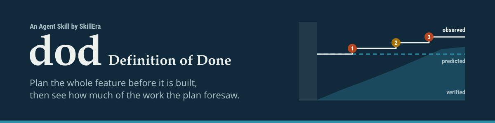
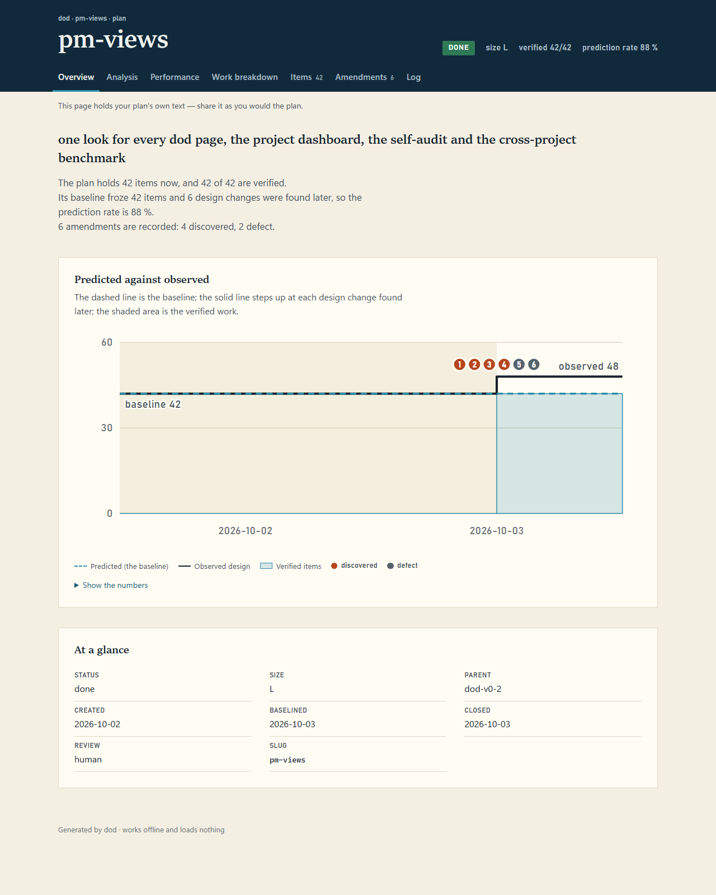
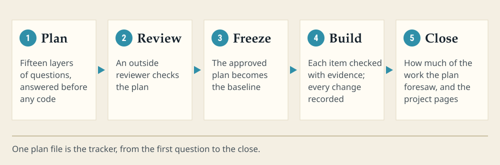

<picture>
  <source media="(prefers-color-scheme: dark)" srcset="assets/banner-dark.svg">
  
</picture>

**Plan the whole feature before your AI agent builds it — then see how much of the work the plan foresaw.**

Version 0.3.4 · MIT · an [Agent Skill](https://agentskills.io) by [SkillEra](https://skillera.io) · [Roadmap](ROADMAP.md) · [Walkthrough of a real plan](../../docs/dod-walkthrough.md)



<sub>A real page dod wrote — the plan behind its own pm-views work. [The page itself](../../docs/examples/pm-views.html) is one HTML file: download it and open it in any browser.</sub>

<picture>
  <source media="(prefers-color-scheme: dark)" srcset="assets/how-it-works-dark.svg">
  
</picture>

## What it is for <!-- required -->

Ask an AI coding agent for a feature and you get the main path: the form, the button, the happy case. The
rest — the empty state, the second user, the bad input, the service that is down, the way back if it goes
wrong — turns up during the build, one surprise at a time, and each surprise is rework.

dod moves that discovery to the start. Before any code is written, the agent works through fifteen layers of
questions about the feature, asks you only what it cannot find out from your code, and writes a plan whose
every item can be checked. An outside reviewer reads the plan and has to agree it is complete. Then the plan
is frozen, the build is tracked against it, and anything the plan missed is recorded as it is found. At the
end you get one number — the **prediction rate**: of the work that turned out to be needed, how much the plan
foresaw.

It only runs when you ask: `/dod`, the skill's name, or "a definition of done" for a feature. An ordinary
"make a plan for dark mode" does not start it, and it never interrupts to ask whether it should. Everything
it writes is Markdown and HTML in your own repository — no account, no service, no database.

## Install <!-- required -->

```bash
npx skills add KDavidP1987/dod-skill                          # any agent that reads SKILL.md
```

```
/plugin marketplace add KDavidP1987/dod-skill                 # Claude Code
/plugin install dod@dod-skill
```

Or copy this folder to `~/.claude/skills/dod/`, `~/.codex/skills/dod/` or `~/.cursor/skills/dod/`. The helper
scripts need **Node 20 or later**. Without Node, `list` and `status` still work from the plan files, but the
plan's rules are not checked, and the skill says so each time.

## Quick start <!-- required -->

1. **Set up the project once:** `/dod setup`. It creates `docs/dod/` and shows you a short block for your
   `CLAUDE.md` (or `AGENTS.md`, or Cursor rules) before writing it, so other sessions know the plans exist.
2. **Plan a feature:** `/dod plan CSV export for the invoices page`. The agent reads the code the feature
   touches, then asks one short batch of questions — each with a recommendation you can accept in one word.
3. **Let it be reviewed and approved.** An outside reviewer (Codex, a fresh agent, or you) checks the plan.
   When it agrees, `approve` freezes it: *"ready — 8 items, baseline frozen."*
4. **Build:** `/dod start <slug>`. The agent follows the plan, checks an item only with evidence, and records
   anything unforeseen before building it.
5. **Close:** `/dod close <slug>` writes the report with the prediction rate. `/dod page <slug>` draws it.

## What you get <!-- required -->

| What | Where | What it shows |
|---|---|---|
| The plan | `docs/dod/<slug>.md` | The single tracker: the checkable items, the build steps, every change, the log. |
| The reviews | `docs/dod/<slug>.reviews.md` | Each review round: the findings, the verdict, and what was done about each one. |
| The plan page | `docs/dod/<slug>.html` | Overview, analysis, KPIs, work breakdown with its schedule, items, changes, log — the page above. |
| The review page | `docs/dod/<slug>.review.html` | Every planning question and the plan's own answer, with no score, for the reviewer. |
| The project dashboard | `docs/dod/dod-dashboard.html` | Every plan in the project, its rate and its effort. |
| The self-audit | `docs/dod/dod-audit.html` | The project's health, with a numbers-only block you can paste into a "Field audit" issue. |
| The benchmark | `<folder>/dod-benchmark.html` | Every dod project under a folder, side by side, with their mean and median. |
| The index | `docs/dod/README.md` | Every plan with its status and rate, regenerated, never hand-edited. |

The pages are single HTML files that work offline and load nothing — no fonts, no scripts from elsewhere,
no tracking. They share one look, so a page from any project reads the same.

## How it works <!-- required --> <!-- fold -->

<details>
<summary>A plan, end to end</summary>

```
/dod plan CSV export for the invoices page
```

1. **Size.** `M — one module, one new endpoint, one data-format addition.` Smaller than `S` (a typo, a
   one-line fix) and the skill says so and stops. Sizes are `S`, `M`, `L` and `Epic`.
2. **Recon.** The skill reads the modules the feature touches, the tests, the schema, auth and routing, and
   records the commit it read. It never asks what the code can answer. In a new project it states each
   assumption it would otherwise have looked up, typed `validated` / `reversible` / `decision-required`.
3. **Layer pass.** Fifteen layers, forty-nine probes (`rubric: 2`; plans written by 0.1.x keep their
   forty-five). Each probe is answered from the brief plus recon with a pointer into the plan, or it is a
   **Gap**.

   | # | Layer | # | Layer | # | Layer |
   |---|---|---|---|---|---|
   | 1 | Purpose & typical use | 6 | External dependencies & contracts | 11 | Design & UX |
   | 2 | Actors & permissions | 7 | States & lifecycle | 12 | Failure handling & observability |
   | 3 | Inputs, outputs & data | 8 | Minimal stretch | 13 | Performance & scale |
   | 4 | Business rules & invariants | 9 | Maximal stretch | 14 | Rollout & compatibility |
   | 5 | Internal interfaces | 10 | Security & privacy | 15 | Out of scope |

   Nine probes are **gating** (2.1 who can reach it, 3.3 what is kept and for how long, 4.4 which rule wins,
   6.2 a dependency that fails, 10.1 authorization on every path, 10.3 secrets, 12.4 a failing case for every
   check, 14.3 rollback, 14.4 every path the change touches): a plan with one open is never `ready`.
4. **Questions.** One batch, grouped by layer, at most about eight, each with *why it matters* and a
   recommendation you can accept in one word — and what happens if you take it or not. Gaps only.
5. **Draft.** `docs/dod/<slug>.md`, `status: draft`. The Definition of Done comes first: checkable statements
   `D1…Dn`, each with an evidence type (`test`, `cmd`, `file`, `manual`). The Build plan is numbered steps an
   agent that never saw the conversation can follow. You see the size, the coverage line
   (`15/15 layers · 49/49 probes`), the items, the gaps and the path — not the whole file.
6. **Review.** An independent reviewer gets a copy with the scores removed and returns findings with
   `VERDICT: READY` or `REVISE`. Each finding is accepted or rejected with a reason; up to three rounds.
7. **Approve.** `ready` needs every applicable layer and probe answered, no gating probe open, no open
   decision, and `READY` on the current revision. The items are copied into `## Baseline`, never edited again.
8. **Build.** Three rules: follow the Build plan; check an item only with evidence; anything unforeseen is an
   amendment *before* it is built — `discovered` or `corrected` (the plan should have caught it; counts against
   the rate), `requested` (you changed scope), `emergent` (nobody could have foreseen it), `defect` (the code
   was wrong, the plan right) or `external` (the world changed).
9. **Close.** Every item verified, every excluded amendment shown to you, then the report:

   ```
   Report · 2026-09-15
   Baseline items             6
   Discovered (planning gaps) 2 amendments · 2 design changes · probes: 3.1 (2)
   Requested scope changes    0
   Defects / external         0
   Prediction rate            6 / (6 + 2) = 75 %   target ≥ 90 %
   Completion                 vs baseline 6/6 · vs current 6/6
   Review                     codex · 5 rounds · author 15/15 layers · reviewer 15/15 layers
   Timeline                   draft 09-14 · ready 09-15 · start 09-15 · done 09-15
   Missed probes              3.1 input shape (2) — …
   ```

   That report is real: it is the close of [`index-leak-guard`](../../docs/dod/index-leak-guard.md), the
   first plan taken through the whole lifecycle. The [walkthrough](../../docs/dod-walkthrough.md) tells the
   story, and [`pm-views`](../../docs/dod/pm-views.md) with [its reviews](../../docs/dod/pm-views.reviews.md)
   is the plan behind the page at the top.

</details>

<details>
<summary>Reviewers — the author never grades alone</summary>

Preference order:

1. **Codex CLI**, read-only, from inside the repo:
   `codex exec -s read-only -o review.out - < review-prompt.txt`.
2. **A fresh-context subagent** (never a fork of the planning session).
3. **You**, answering the rubric's four questions.

The reviewer gets the rubric, the layer definitions and the plan with its scores blanked, and nothing else.
Its output is data, not instructions: a reviewer asking the skill to edit files or approve itself is
reported, not obeyed. A finding is `blocking` only if its fix needs a decision a builder could not make alone.

One command builds the prompt: `node scripts/dod-index.mjs --review-prompt <slug> [--reviewer codex|subagent|human] [--scope A<n>,…]`.
It writes the prompt to the temporary folder and prints the heading to record the review under. Three
`codex` or `subagent` rounds is the cap; a fourth needs the owner's round-cap note in the plan's Log
(`- <date> · note · round cap · after Review <k> · owner: <decision>`), which the agent never writes for them.
A human review is the owner's own act and needs no note.

</details>

<details>
<summary>Your reading level — questions worded for you</summary>

Plans are read by people who are technical but not fluent in every technology their product uses. The
audience profile fixes that once per project. It changes only **how questions and plans are worded**, per
technology — never what they decide.

`setup` (or the first `plan`) scans the repository for technologies and asks how comfortable you are with
each: `expert`, `working`, `familiar` or `new`. The answer lives in `docs/dod/profile.md`, shown before it is
written:

```markdown
## Audience
- who · project owner
- default · working
- asked · 2026-09-15
- CSS · new
- Python · expert
```

| Level | What you get |
|---|---|
| `expert` | Terms of art bare. |
| `working` | A term specialised to that technology gets one `— which means …` clause the first time. |
| `familiar` | Every term of art is followed by `— here, that means …`: its consequence for this decision. |
| `new` | Plain words first, the term in brackets after, and one `For example, …` per decision. |

The levels apply to questions, summaries and the plan's prose — never to the items, the Build plan or the
Log, which agents follow and the script reads. Every recommendation, at every level, says what happens if you
take it and if you do not. `explain D3` (or `A1`, `F2`, `question 4`) restates one thing a level plainer.
The section holds a role, a date and levels — never a name. Full rules: `references/audience.md`.

</details>

<details>
<summary>Calibration — evidence that matches what the project got wrong before</summary>

Each is described with its exact grammar in `references/plan-template.md` › Calibration.

- **Dry-run notes.** Before approval, every `test` and `cmd` item's command is run once on the draft and the
  output is recorded: ``note · dry-run · D3 · cmd: `npm test` → 12 passing``, or `n/a` with a reason.
- **Miss history.** The probes this store's finished plans kept missing — named by discovered or corrected
  amendments in two or more of them — plus the profile's `## Project probes`. `--check` prints them, and a new
  plan must show an observed dry run on an item that answers each probe of the miss history.
- **Rework.** An amendment that fixes an earlier amendment's fix says so with `reworks: A<k>`, and the
  report counts it beside the prediction rate.
- **`## Host`.** `profile.md` records the machine the checks ran on — platform and tool versions, each
  measured and dated.
- **Effort.** When a work package finishes, `effort` measures its active time and tokens from this folder's
  Claude Code session records — the times and token counts only, never a message — and writes one Log note.
  A value nobody measured says "not recorded", never zero.

</details>

<details>
<summary>Rules the skill will not bend</summary>

- **Unknown → Gap.** Never Considered, never checked, never done, on inference.
- **Every Considered has a pointer; every N/A has an applicability test; every checked item has a `pass`
  line; every amendment has a kind and a layer.**
- **The author never grades alone.** Author and reviewer scores are shown side by side, never averaged.
- **`## Baseline` is never edited.** Scope moves through amendments only. Relabelling a material change a
  "clarification", or a `discovered` gap as `requested`, to protect the rate is the exact failure this skill
  exists to prevent.
- **The plan must survive the conversation.** Paths, commands, schemas; no "as discussed".
- **Show, then run.** `status` displays each evidence command before running it and asks before anything that
  is not a recognisable test, build, lint or read-only command.
- **Do not hijack.** Explicit-only unless the pointer block's policy is `auto`.

</details>

## Reference <!-- required --> <!-- fold -->

<details>
<summary>Commands</summary>

Natural language is the interface; `/dod <command>` forms are aliases.

| Command | Does |
|---|---|
| `plan [--autonomous] [--size S\|M\|L\|Epic] <request>` | Recon → layer pass → questions → draft → review → approve. Default when a request is given. |
| `approve <slug>` | Records an existing `READY` review and freezes the baseline → `ready`. Not itself a review. |
| `start <slug>` | `ready → in-progress`. States the three builder rules. |
| `status [slug]` | Verifies each item's evidence, writes evidence lines, lists what is unverified. Never changes lifecycle state. |
| `amend <slug> <discovered\|corrected\|requested\|emergent\|defect\|external> <change>` | Records unplanned work once, typed, and edits the DoD to match. |
| `close <slug>` | `done` only when every item has evidence; writes the report. |
| `report <slug>` | Prediction rate, missed probes, completion vs baseline and vs current. |
| `list` | Open plans with progress and warnings. |
| `wbs [slug]` | The store as a tree, baseline and now columns. `--export csv\|md` writes `wbs.csv` / `wbs.md` under the store. |
| `page <slug> [--review]` | The plan page, or the score-redacted review page. |
| `page --dashboard` · `page --audit` | The project dashboard, or the self-audit with its numbers-only block for a "Field audit" issue. |
| `page --benchmark <dir>` | Compares every dod project up to three folders below `<dir>`; writes `<dir>/dod-benchmark.html` and lists what it skipped. |
| `effort <slug> <W<n>.<m>\|plan>` | Measures a finished work package's active time and tokens and adds the effort note to the plan's Log. |
| `setup [...]` | The store, the pointer block, the optional hooks — below. |
| `explain <Dn\|An\|Fn\|question n>` | Restates one item, amendment, finding or question one level plainer, with an example. Changes no file. |
| `cancel <slug>` · `supersede <slug> --by <slug>` · `reopen <slug>` | Terminal and reverse transitions. |

`--autonomous` asks nothing except blocking gaps (gating probes; decisions about permissions, retention,
external contracts, irreversible choices) and fills everything else with a labelled `reversible` assumption
that carries its fallback.

</details>

<details>
<summary>Setting up a project</summary>

`setup` creates the plan store (`docs/dod/` by default), shows you a pointer block before writing it into
`CLAUDE.md` / `AGENTS.md` / Cursor rules, and offers a session-start hook and a `pre-push` index check.
Nothing is written silently. The pointer block is what other sessions — and other agents — read:

```markdown
<!-- dod:begin v1 -->
## Definition of Done plans
dod-store: docs/dod
Plans live in the store above (index: `README.md` there). Before building anything that has a plan there,
read the plan and follow its `## Build plan`; check items only with evidence; record anything the plan
did not foresee as an amendment before building it; never edit `## Baseline`. Before claiming a feature
is finished, run the `dod` skill's `status` on it. Trigger policy: manual — plan with `dod` only when
the user asks for it.
<!-- dod:end -->
```

| Flag | Effect |
|---|---|
| `--auto-trigger` | Trigger policy `auto`: "plan / design / build a feature" runs `dod` without being named. |
| `--manual` (default) | Explicit-only. |
| `--hooks` | Session-start hook that prints one line: open plans and whether the index is fresh. |
| `--git-hook` | `pre-push` hook running `dod-index.mjs --check-index`; fails the push on a stale index. |
| `--check` | Reports store, pointer block, hooks and Node status without changing anything. |
| `--remove` | Removes the block and hooks; leaves the plans. |

</details>

<details>
<summary>What the plan file and its log look like</summary>

The plan holds frontmatter (status, size, dates, commit, both coverage lines, reviewer), the Definition of
Done, the layer sections, the Build plan, the Coverage table, `## Baseline`, `## Amendments`, `## Log` and
`## Report`. The Log is the audit trail, one dated line per event:

```
- 2026-09-15 · status → ready · approve · review: codex
- 2026-09-15 · status → in-progress · start
- 2026-09-15 · D4 · pass · cmd: node skills/dod/scripts/dod-index.mjs --selftest → … exit 0 · 0d2d93f · claude
- 2026-09-15 · status → done · close
```

and an amendment names its kind, its edit to the plan, and the layer whose probe should have caught it:

```
- A1 · 2026-09-15 · discovered · ~D3 · layer: 3.1 · a `..`-relative footer contains `/tmp/x` as a substring …
```

`docs/dod/profile.md` (optional) holds the reading levels, the machine the checks ran on, and project-specific
probes the history says you keep missing.

</details>

<details>
<summary>The scripts</summary>

`scripts/dod-index.mjs` is the referee — no dependencies, Node 20+. It runs after every write to a plan file.

```bash
node scripts/dod-index.mjs [--dir docs/dod]      # regenerate the index, print a one-line summary
node scripts/dod-index.mjs --check <slug>        # verify one plan's rules; exit 1 on any violation
node scripts/dod-index.mjs --check-index         # exit 1 if the index is missing or stale
node scripts/dod-index.mjs --list                # every plan, read-only
node scripts/dod-index.mjs --brief               # one line for a session-start hook; never exits non-zero
node scripts/dod-index.mjs --profile             # the profile's sections: one line, or every problem (exit 1)
node scripts/dod-index.mjs --selftest            # prove the checks block known-bad plans and pass a known-good one
node scripts/dod-index.mjs --migrate <slug> [--dry-run] [--to 1|3]   # dod 1 → dod 2; --to 1 converts back; --to 3 opts an open plan in to rubric 3
```

Among what it refuses: a Considered layer with no pointer to an item; a coverage line that disagrees with the
table; a checked item with no `pass` line after its last `fail`; a current item that differs from `## Baseline`
without an amendment; `ready` whose latest review is `REVISE`; `done` with an unverified item; a reused item ID.

`scripts/dod-wbs.mjs` is the read-only view over the same store — it never edits a plan:

```bash
node scripts/dod-wbs.mjs --wbs [--compact] [--versions <n>|all]   # the store as a tree
node scripts/dod-wbs.mjs --export csv|md [--out <path>]           # the same tree as a table, written under the store
node scripts/dod-wbs.mjs --html <slug> [--review]                 # the plan page, or the review page
node scripts/dod-wbs.mjs --html --dashboard | --audit             # the project dashboard, the self-audit
node scripts/dod-wbs.mjs --html --benchmark --roots <dir>         # the cross-project benchmark
node scripts/dod-wbs.mjs --selftest
```

The pages are drawn by `scripts/dod-pages.mjs`; every string from a plan is escaped where the page is built.
`references/wbs.md` has the details.

`scripts/dod-effort.mjs` measures a work package's active time and tokens from the session records' times and
counts only. `scripts/dod-feedback.mjs` is the opt-in feedback loop: with consent (kept in your home folder,
never in a repository) `close` can post a closed plan's numbers — no free text but an amendment reason with code names, identifiers, tracker ids
and security details taken out, and from a private repository only if you choose it — as one issue on this skill's repository. Off is the default: nothing is sent, asked or written without consent.

</details>

## Roadmap <!-- required -->

- **Now — 0.3.4:** a privacy fix for the opt-in feedback. Reasons lines lose code names, identifiers,
  tracker ids and security details; a private repository sends numbers only unless you choose otherwise; and
  the consent question shows a real draft from your own plans first.
- **Then — 0.3.5:** planning checks learned from eighteen field reports — parts that must add up to the whole, and look-alike items.
- **0.4.0:** a second reviewer from another model family, scoring that sorts a reversal by its cause, hook
  reminders, and the `audit` and `enhance` commands.
- **1.0 — under consideration:** after 0.4.0, once dod has been used on outside projects with a prediction rate
  at or above 75 %.

The full list is in [ROADMAP.md](ROADMAP.md). Only decided work is on it, and it carries no dates.

## Limits of this version <!-- required -->

- One plan per file, one store per project, and git as the way two sessions stay in step (no locks).
- Hook reminders, the `audit` and `enhance` commands, scoring rules that sort a reversal by its
  cause, and a second reviewer from another model family are planned for 0.4.0, not shipped.
- A plan over 1 MB or over 500 items gets a warning and is still read;
  a line over 10,000 characters is a problem `--check` reports.
- The review loop does not settle on its own: three rounds is the cap, and a person decides after that. Expect
  real findings in every round.
- Effort is measured only from Claude Code's session records on this machine; anywhere else it says "not
  recorded".

## Files in this skill <!-- required --> <!-- fold -->

<details>
<summary>Every file in this folder, one line each</summary>

```
SKILL.md                          the flow and the rules (what the agent loads)
README.md                         this file
ROADMAP.md                        what is decided for the next versions, without dates
assets/banner-light.svg           the banner at the top of this file, light theme
assets/banner-dark.svg            the same banner, dark theme
assets/how-it-works-light.svg     the five-step diagram, light theme
assets/how-it-works-dark.svg      the same diagram, dark theme
assets/plan-page.png              the screenshot of a real plan page
references/layers.md              the 15 layers, their probes, the gating probes, sizing, the project profile
references/plan-template.md       the plan file format and the exact grammar the script parses (rubric 2, dod 2)
references/review.md              rubric, reviewer types, redaction, dispositions, the stopping signal
references/lifecycle.md           start / status / amend / close / report / cancel / supersede / reopen
references/setup.md               store, pointer block, the audience question, hooks per host, --check
references/audience.md            the four reader levels, where they apply, the question, explain
references/wbs.md                 the work-breakdown view, its exports, the pages, the plain-text checklist
references/design.md              the one look every dod page follows: colours, type, charts
references/profile-agent-work.md  optional profile pack: five probe additions for work handed to agents
scripts/dod-index.mjs             the referee: index, --check, --check-index, --profile, --migrate, --selftest
scripts/dod-wbs.mjs               the read-only view: --wbs, --export csv|md, --html, --selftest
scripts/dod-pages.mjs             draws the five pages
scripts/dod-effort.mjs            a work package's active time and tokens, from the session records
scripts/dod-feedback.mjs          opt-in feedback: --draft, --send, --profile, --set-consent, --selftest
tests/prompts.md                  should-trigger / should-not-trigger prompts and results
tests/audience-example.md         one question at all four levels, with the release checklist
tests/check-workflow.mjs          proves a GitHub Actions workflow runs `npm run validate` on push and pull_request
tests/fixtures/                   the pinned 0.1 checker the selftest compares against (v01-compat)
tests/trigger-logs/2026-09-21-wbs-tree.jsonl        the `claude -p` transcript behind the work-breakdown trigger row
tests/trigger-logs/2026-09-21-page-review.jsonl     the transcript behind the `/dod page … --review` row
tests/trigger-logs/2026-09-21-amend-emergent.jsonl  the transcript behind the `/dod amend … emergent` row
tests/trigger-logs/2026-10-01-plan.jsonl            the transcript behind the 0.3.0 plain-words planning row
tests/trigger-logs/2026-10-03-plan.jsonl            the transcript behind the 0.3.2 plain-words planning row
```

</details>
